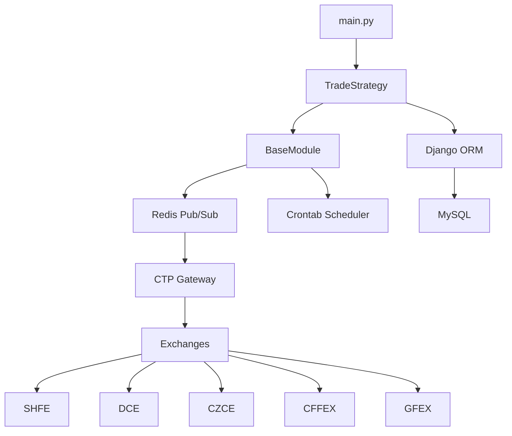

# Trade Trader

[English](README.md) | [中文](README_CN.md)

An event-driven futures trading system for Chinese commodity exchanges, integrating five major exchanges: SHFE, DCE, CZCE, CFFEX, and GFEX. The system uses Redis pub/sub for real-time messaging and Django ORM for data persistence.

## Features

- **Multi-Exchange Support**: Connects to 5 major Chinese futures exchanges
  - SHFE (Shanghai Futures Exchange)
  - DCE (Dalian Commodity Exchange)
  - CZCE (Zhengzhou Commodity Exchange)
  - CFFEX (China Financial Futures Exchange)
  - GFEX (Guangzhou Futures Exchange)

- **Event-Driven Architecture**: Built on async/await pattern with Redis pub/sub for real-time message handling

- **Strategy Framework**: Extensible base class (`BaseModule`) for custom trading strategies with:
  - Redis channel callback registration via decorators
  - Cron-based scheduled task support
  - Async message processing

- **Data Persistence**: Django ORM integration with MySQL backend

- **Logging System**: Three-tier logging (file, console, Redis pub/sub)

- **Technical Analysis**: TA-Lib integration for market data analysis

## Architecture



## Requirements

- Python 3.7+
- Redis server
- MySQL database
- TA-Lib C library

## Installation

1. Install TA-Lib C library first, then install Python dependencies:

```bash
pip install -r requirements.txt
```

2. Configure MySQL timeout settings in `/etc/my.cnf.d/server.cnf`:

```ini
[mysqld]
wait_timeout=31536000
interactive_timeout=31536000
```

3. On first run, the configuration file will be auto-generated at `~/.config/trade-trader/config.ini`. Edit it to configure:

- `[DASHBOARD]` - Django Dashboard project path (required)
- `[REDIS]` - Redis connection settings
- `[MYSQL]` - MySQL database connection
- `[MSG_CHANNEL]` - Redis pub/sub channel patterns
- `[TRADE]` - Trading parameters
- `[LOG]` - Logging configuration

## Usage

Start the trading system:

```bash
python -m trade_trader.main
```

The entry point initializes Django, sets up logging (file, console, and Redis pub/sub), writes a PID file, and runs `TradeStrategy` from `trade_trader/strategy/brother2.py`.

## Creating Custom Strategies

Extend the `BaseModule` class to create custom trading strategies:

```python
from trade_trader.strategy import BaseModule
from trade_trader.utils.func_container import RegisterCallback

class MyStrategy(BaseModule):
    @RegisterCallback(channel='MSG:CTP:REQ:*')
    async def on_request(self, channel, data):
        """Handle Redis channel messages"""
        pass

    @RegisterCallback(crontab='*/5 * * * *')
    async def periodic_task(self):
        """Run every 5 minutes"""
        pass
```

## Configuration

Configuration file location: `~/.config/trade-trader/config.ini`

| Section | Description |
|---------|-------------|
| `[REDIS]` | Redis connection settings |
| `[MYSQL]` | Database connection |
| `[MSG_CHANNEL]` | Redis pub/sub channel patterns |
| `[DASHBOARD]` | Django Dashboard project path |
| `[TRADE]` | Command timeout and ignored contracts |
| `[LOG]` | Log levels and formats |
| `[QuantDL]`, `[Tushare]` | Third-party API keys |

## Documentation

Detailed technical documentation is available in the `docs/` directory:

- [docs/README.md](docs/README.md) - Documentation index
- [docs/ARCHITECTURE.md](docs/ARCHITECTURE.md) - System architecture (with Mermaid diagrams)
- [docs/MODULES.md](docs/MODULES.md) - Module details
- [docs/DATA_MODELS.md](docs/DATA_MODELS.md) - Django data models
- [docs/CODEBASE_MAP.md](docs/CODEBASE_MAP.md) - Codebase navigation guide

## Project Structure

| Component | File | Description |
|-----------|------|-------------|
| Entry point | `trade_trader/main.py` | System startup |
| Strategy base | `trade_trader/strategy/__init__.py` | BaseModule |
| Main strategy | `trade_trader/strategy/brother2.py` | TradeStrategy |
| Configuration | `trade_trader/utils/read_config.py` | Config management |
| Utilities | `trade_trader/utils/__init__.py` | Exchange data |
| Models | `panel/models.py` | Django ORM models |

## Code Style

- Extensive Chinese comments and log messages
- Uses `ujson` for faster JSON parsing
- All financial calculations use `Decimal`
- Uses `price_round()` for contract-specific price precision
- Comprehensive async/await pattern with `asyncio`
- CTP error codes loaded from XML `ctp_errors` dictionary

## License

Apache License 2.0

```
Copyright 2016 timercrack

Licensed under the Apache License, Version 2.0 (the "License"); you may
not use this file except in compliance with the License. You may obtain
a copy of the License at

    http://www.apache.org/licenses/LICENSE-2.0

Unless required by applicable law or agreed to in writing, software
distributed under the License is distributed on an "AS IS" BASIS, WITHOUT
WARRANTIES OR CONDITIONS OF ANY KIND, either express or implied. See the
License for the specific language governing permissions and limitations
under the License.
```
