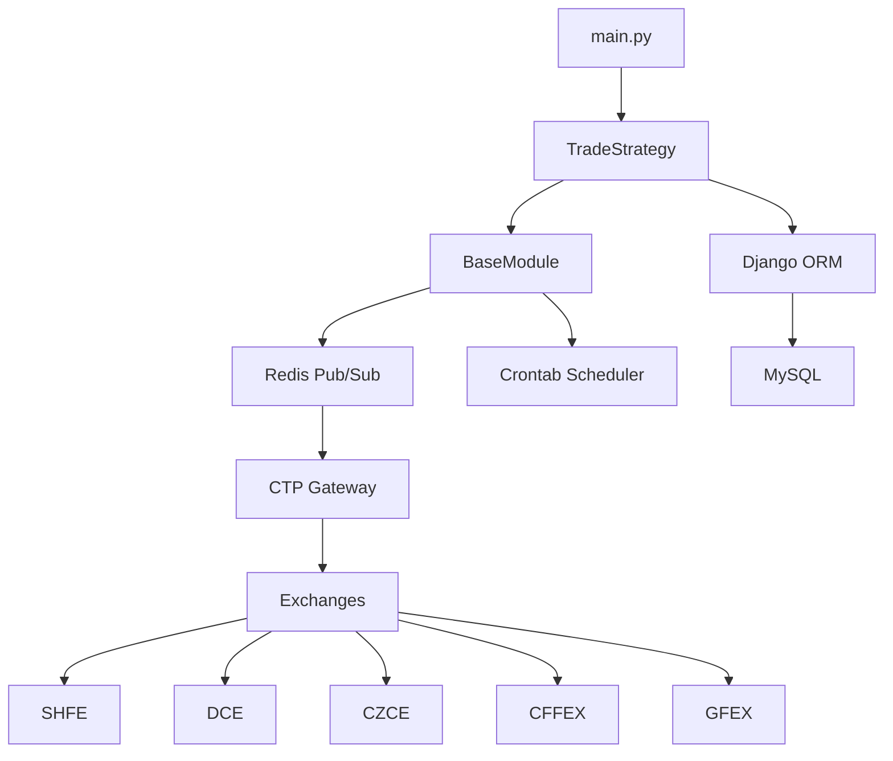

# Trade Trader

[English](README.md) | [中文](README_CN.md)

一个面向中国期货市场的交易系统，集成五大期货交易所：上期所、大商所、郑商所、中金所和广期所。系统采用事件驱动架构，使用 Redis 发布订阅进行实时消息传递，Django ORM 进行数据持久化。

## 功能特性

- **多交易所支持**：连接 5 大中国期货交易所
  - SHFE（上海期货交易所）
  - DCE（大连商品交易所）
  - CZCE（郑州商品交易所）
  - CFFEX（中国金融期货交易所）
  - GFEX（广州期货交易所）

- **事件驱动架构**：基于 async/await 异步模式，使用 Redis pub/sub 处理实时消息

- **策略框架**：可扩展的策略基类（`BaseModule`），支持：
  - 通过装饰器注册 Redis 频道回调
  - Cron 定时任务支持
  - 异步消息处理

- **数据持久化**：Django ORM 集成 MySQL 后端

- **日志系统**：三层日志（文件、控制台、Redis 发布订阅）

- **技术分析**：集成 TA-Lib 进行行情数据分析

## 系统架构



## 环境要求

- Python 3.7+
- Redis 服务器
- MySQL 数据库
- TA-Lib C 库

## 安装

1. 先安装 TA-Lib C 库，再安装 Python 依赖：

```bash
pip install -r requirements.txt
```

2. 配置 MySQL 超时设置，在 `/etc/my.cnf.d/server.cnf` 中添加：

```ini
[mysqld]
wait_timeout=31536000
interactive_timeout=31536000
```

3. 首次运行时，配置文件会在 `~/.config/trade-trader/config.ini` 自动生成。编辑该文件配置：

- `[DASHBOARD]` - Django Dashboard 项目路径（必需）
- `[REDIS]` - Redis 连接设置
- `[MYSQL]` - MySQL 数据库连接
- `[MSG_CHANNEL]` - Redis 发布订阅频道模式
- `[TRADE]` - 交易参数
- `[LOG]` - 日志配置

## 运行

启动交易系统：

```bash
python -m trade_trader.main
```

入口点会初始化 Django、设置日志（文件、控制台和 Redis pub/sub）、写入 PID 文件，并运行 `trade_trader/strategy/brother2.py` 中的 `TradeStrategy`。

## 创建自定义策略

继承 `BaseModule` 类创建自定义交易策略：

```python
from trade_trader.strategy import BaseModule
from trade_trader.utils.func_container import RegisterCallback

class MyStrategy(BaseModule):
    @RegisterCallback(channel='MSG:CTP:REQ:*')
    async def on_request(self, channel, data):
        """处理 Redis 频道消息"""
        pass

    @RegisterCallback(crontab='*/5 * * * *')
    async def periodic_task(self):
        """每 5 分钟执行一次"""
        pass
```

## 配置说明

配置文件位置：`~/.config/trade-trader/config.ini`

| 配置节 | 描述 |
|--------|------|
| `[REDIS]` | Redis 连接设置 |
| `[MYSQL]` | 数据库连接 |
| `[MSG_CHANNEL]` | Redis pub/sub 频道模式 |
| `[DASHBOARD]` | Django Dashboard 项目路径 |
| `[TRADE]` | 命令超时和忽略的合约 |
| `[LOG]` | 日志级别和格式 |
| `[QuantDL]`、`[Tushare]` | 第三方 API 密钥 |

## 文档

详细技术文档位于 `docs/` 目录：

- [docs/README.md](docs/README.md) - 文档索引
- [docs/ARCHITECTURE.md](docs/ARCHITECTURE.md) - 系统架构（含 Mermaid 图）
- [docs/MODULES.md](docs/MODULES.md) - 模块详解
- [docs/DATA_MODELS.md](docs/DATA_MODELS.md) - Django 数据模型说明
- [docs/CODEBASE_MAP.md](docs/CODEBASE_MAP.md) - 代码库映射

## 项目结构

| 组件 | 文件 | 说明 |
|------|------|------|
| 入口点 | `trade_trader/main.py` | 系统启动 |
| 策略基类 | `trade_trader/strategy/__init__.py` | BaseModule |
| 主策略 | `trade_trader/strategy/brother2.py` | TradeStrategy |
| 配置 | `trade_trader/utils/read_config.py` | 配置管理 |
| 工具 | `trade_trader/utils/__init__.py` | 交易所数据 |
| 模型 | `panel/models.py` | Django ORM 模型 |

## 代码规范

- 大量中文注释和日志消息
- 使用 `ujson` 进行 JSON 解析（比标准 `json` 更快）
- 所有金融计算使用 `Decimal`
- 使用 `price_round()` 函数处理合约特定的价格精度
- 全面使用 async/await 模式配合 `asyncio`
- 错误码从 XML 加载的 `ctp_errors` 字典获取

## 许可证

Apache License 2.0

```
Copyright 2016 timercrack

Licensed under the Apache License, Version 2.0 (the "License"); you may
not use this file except in compliance with the License. You may obtain
a copy of the License at

    http://www.apache.org/licenses/LICENSE-2.0

Unless required by applicable law or agreed to in writing, software
distributed under the License is distributed on an "AS IS" BASIS, WITHOUT
WARRANTIES OR CONDITIONS OF ANY KIND, either express or implied. See the
License for the specific language governing permissions and limitations
under the License.
```
