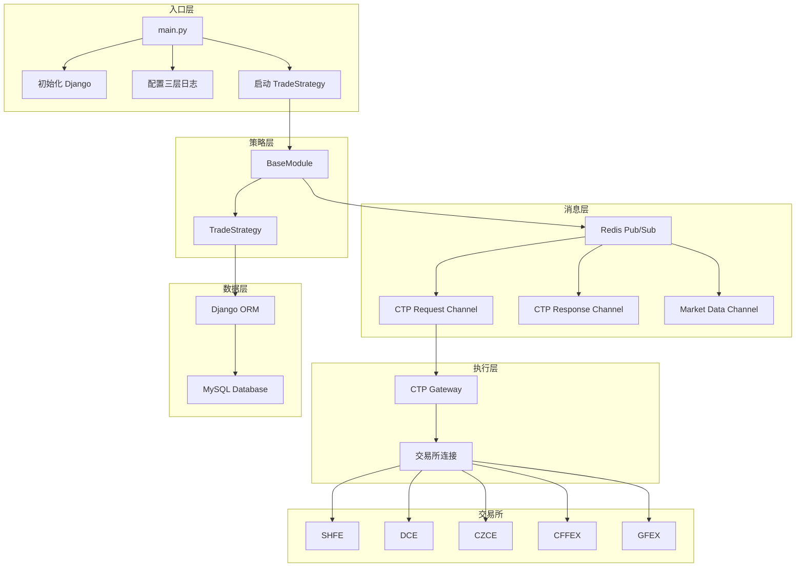
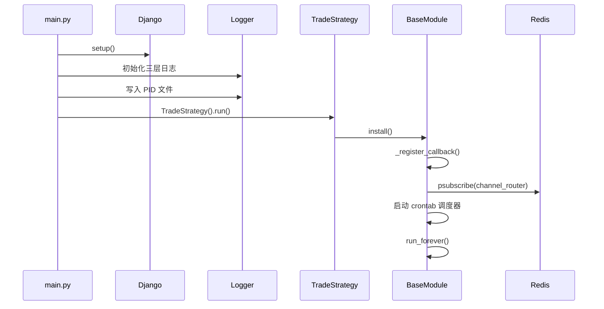
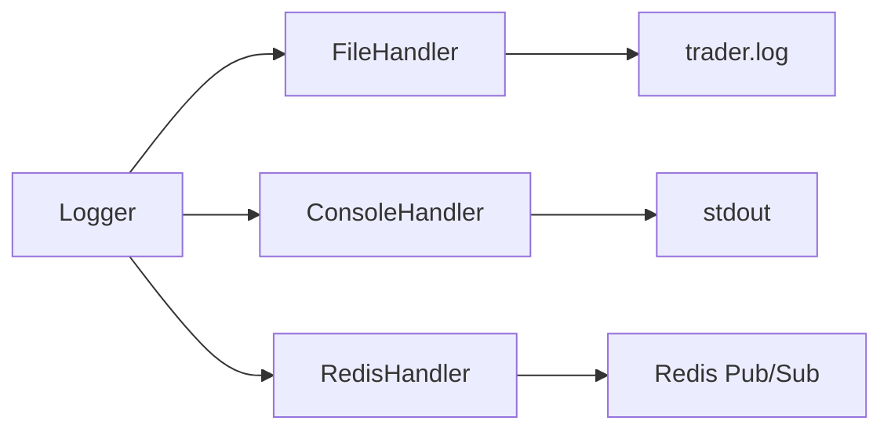
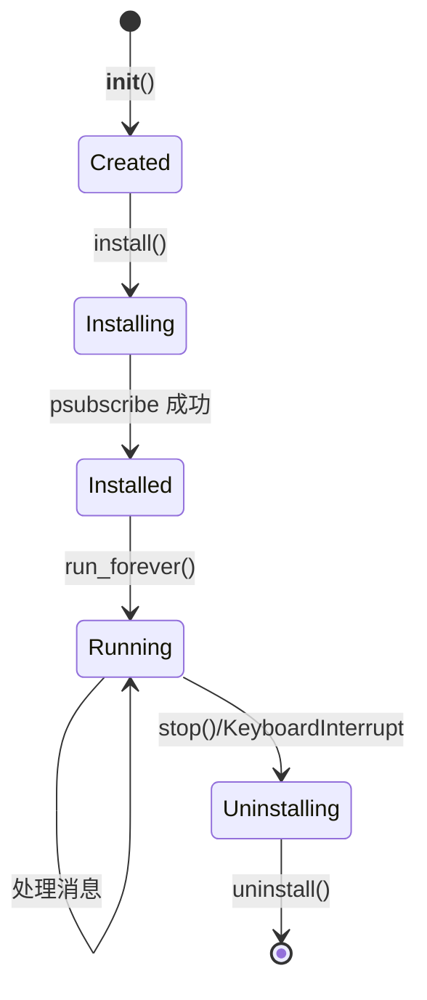
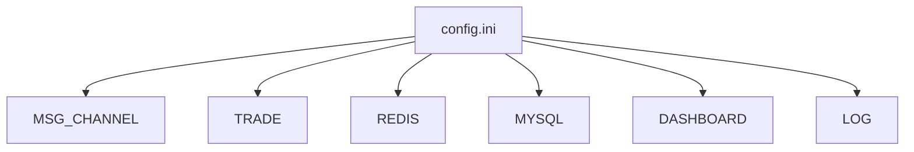
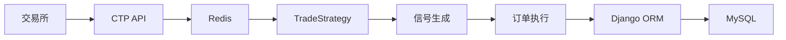

# 系统架构文档

## 概述

Trader 是一个事件驱动的中国期货交易系统，采用 Redis 发布订阅模式进行实时消息传递，使用 Django ORM 进行数据持久化。

## 系统架构图



## 启动流程



## Redis 消息通道

### 请求通道格式

```
MSG:CTP:REQ:{operation}
```

### 交易响应格式

```
MSG:CTP:RSP:TRADE:{broker_id}:{request_id}
```

### 行情响应格式

```
MSG:CTP:RSP:MARKET:{broker_id}:{request_id}
```

### 日志通道

```
MSG:LOG:WEIXIN
```

## 日志架构



## BaseModule 生命周期



## 回调注册机制

### 频道订阅

使用 `@RegisterCallback` 装饰器注册 Redis 频道回调：

```python
@RegisterCallback(channel='MSG:CTP:REQ:*')
async def on_request(self, channel, data):
    pass
```

### 定时任务

使用 `crontab` 参数注册定时任务：

```python
@RegisterCallback(crontab='*/5 * * * *')
async def periodic_task(self):
    pass
```

## 配置管理

配置文件位置：`~/.config/trade_trader/config.ini`



## 数据流向



## 关键时序

1. **初始化**: Django setup → 日志配置 → PID 写入
2. **策略启动**: install() → 回调注册 → Redis 订阅
3. **消息处理**: Redis 消息 → 频道路由 → 回调函数
4. **关闭**: stop() → Redis 取消订阅 → 事件循环停止
