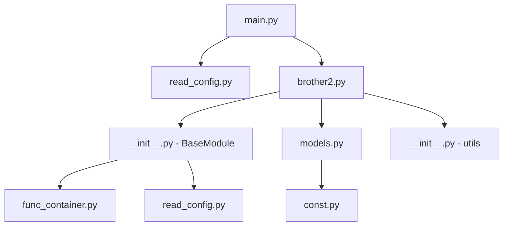

# 代码库映射文档

> 供 LLM 快速导航代码库的索引

## 目录结构

```
trade_trader/
├── CLAUDE.md                 # 项目指南（供 Claude Code 使用）
├── README.rst                # 项目说明（空，需完善）
├── requirements.txt          # Python 依赖
│
├── docs/                     # 文档目录
│   ├── README.md             # 文档索引
│   ├── ARCHITECTURE.md       # 系统架构
│   ├── MODULES.md            # 模块详解
│   ├── DATA_MODELS.md        # 数据模型
│   ├── CODEBASE_MAP.md       # 本文件
│   ├── CLEANUP_TODO.md       # 清理待办
│   └── progress.md           # 进度跟踪
│
├── panel/                    # Django 数据模型
│   ├── __init__.py
│   ├── apps.py
│   ├── const.py              # 枚举常量定义
│   └── models.py             # Django ORM 模型
│
└── trade_trader/                   # 主应用
    ├── __init__.py
    ├── main.py               # 入口点 (78 行)
    │
    ├── strategy/             # 交易策略
    │   ├── __init__.py       # BaseModule 基类 (~140 行)
    │   └── brother2.py       # 主交易策略 (871 行)
    │
    └── utils/                # 工具模块
        ├── __init__.py       # 交易所数据获取
        ├── ApiStruct.py      # CTP API 结构
        ├── fetch_data.py     # 数据获取脚本
        ├── func_container.py # 回调容器装饰器
        ├── my_logger.py      # 日志配置
        ├── read_config.py    # 配置管理
        ├── tick.py           # Tick 处理
        └── error.xml         # CTP 错误码
```

## 文件快速索引

### 入口与初始化

| 文件 | 行数 | 关键内容 |
|------|------|---------|
| `trade_trader/main.py:16-24` | 9 | Django 设置，Dashboard 路径配置 |
| `trade_trader/main.py:35-45` | 11 | RedislHandler 类定义 |
| `trade_trader/main.py:48-77` | 30 | 主函数：日志初始化、PID、启动策略 |

### 策略基类

| 文件 | 行数 | 关键内容 |
|------|------|---------|
| `trade_trader/strategy/__init__.py:36-56` | 21 | BaseModule.__init__ |
| `trade_trader/strategy/__init__.py:58-69` | 12 | _register_callback |
| `trade_trader/strategy/__init__.py:80-93` | 14 | install |
| `trade_trader/strategy/__init__.py:95-108` | 14 | uninstall |
| `trade_trader/strategy/__init__.py:110-121` | 12 | _msg_reader |
| `trade_trader/strategy/__init__.py:129-139` | 11 | run |

### 配置管理

| 文件 | 行数 | 关键内容 |
|------|------|---------|
| `trade_trader/utils/read_config.py:23-68` | 46 | config_example 模板 |
| `trade_trader/utils/read_config.py:70-78` | 9 | 配置文件自动创建 |
| `trade_trader/utils/read_config.py:83-93` | 11 | get_dashboard_path |
| `trade_trader/utils/read_config.py:96-98` | 3 | get_error_xml_path |
| `trade_trader/utils/read_config.py:101-103` | 3 | ctp_errors 加载 |

### 数据模型

| 文件 | 行数 | 关键内容 |
|------|------|---------|
| `panel/const.py:19-31` | 13 | 交易所类型 (ExchangeType) |
| `panel/const.py:65-87` | 23 | 方向和开平标志 |
| `panel/const.py:90-110` | 21 | 报单状态 |
| `panel/const.py:112-136` | 25 | DCE 品种代码映射 |
| `panel/const.py:138-151` | 14 | 月份代码映射 |
| `panel/const.py:165-177` | 13 | 信号类型 |
| `panel/models.py:25-39` | 15 | to_df 工具函数 |
| `panel/models.py:42-44` | 3 | Autonumber 模型 |
| `panel/models.py:47-58` | 12 | Address 模型 |
| `panel/models.py:61-82` | 22 | Broker 模型 |
| `panel/models.py:104-125` | 22 | Strategy 模型 |
| `panel/models.py:146-170` | 25 | Instrument 模型 |
| `panel/models.py:173-191` | 19 | Signal 模型 |
| `panel/models.py:237-259` | 23 | Order 模型 |
| `panel/models.py:262-288` | 27 | Trade 模型 |

## 重要概念映射

### Dashboard 路径配置

**问题**: 硬编码路径分散在多个文件

**解决方案**: 使用 `config.ini` 的 `[DASHBOARD]` 节

| 文件 | 原位置 | 新方式 |
|------|--------|--------|
| `trade_trader/main.py:19-24` | 硬编码 | `get_dashboard_path()` |
| `trade_trader/utils/fetch_data.py:10-15` | 硬编码 | `get_dashboard_path()` |

### Redis 消息格式

| 类型 | 格式 | 位置 |
|------|------|------|
| 请求 | `MSG:CTP:REQ:{operation}` | `read_config.py:25-26` |
| 交易响应 | `MSG:CTP:RSP:TRADE:{broker_id}:{request_id}` | `read_config.py:28-29` |
| 行情响应 | `MSG:CTP:RSP:MARKET:{broker_id}:{request_id}` | `read_config.py:30-31` |
| 日志 | `MSG:LOG:WEIXIN` | `read_config.py:32` |

### 回调注册

| 装饰器参数 | 用途 | 示例 |
|-----------|------|------|
| `channel='pattern'` | Redis 频道订阅 | `@RegisterCallback(channel='MSG:CTP:REQ:*')` |
| `crontab='expr'` | Cron 定时任务 | `@RegisterCallback(crontab='*/5 * * * *')` |

## 常用任务快速查找

| 任务 | 相关文件 | 关键函数/类 |
|------|---------|-------------|
| 添加新交易所 | `trade_trader/utils/__init__.py` | 信号量配置, 更新函数 |
| 添加新策略 | `trade_trader/strategy/` | 继承 BaseModule |
| 修改 Redis 配置 | `~/.config/trade_trader/config.ini` | `[REDIS]` 节 |
| 修改 Dashboard 路径 | `~/.config/trade_trader/config.ini` | `[DASHBOARD]` 节 |
| 查看信号类型 | `panel/const.py` | SignalType |
| 查看订单状态 | `panel/const.py` | OrderStatus |
| 添加日志级别 | `trade_trader/main.py` | logger.setLevel |

## 依赖关系图



## 配置文件完整示例

```ini
[MSG_CHANNEL]
request_pattern = MSG:CTP:REQ:*
request_format = MSG:CTP:REQ:{}
trade_response_prefix = MSG:CTP:RSP:TRADE:
trade_response_format = MSG:CTP:RSP:TRADE:{}:{}
market_response_prefix = MSG:CTP:RSP:MARKET:
market_response_format = MSG:CTP:RSP:MARKET:{}:{}
weixin_log = MSG:LOG:WEIXIN

[TRADE]
command_timeout = 5
ignore_inst = WH,bb,JR,RI,RS,LR,PM,im

[REDIS]
host = 127.0.0.1
port = 6379
db = 0
encoding = utf-8

[MYSQL]
host = 127.0.0.1
port = 3306
db = QuantDB
user = quant
password = 123456

[DASHBOARD]
path = /path/to/dashboard

[LOG]
level = DEBUG
format = %(asctime)s %(name)s [%(levelname)s] %(message)s
weixin_format = [%(levelname)s] %(message)s
```
