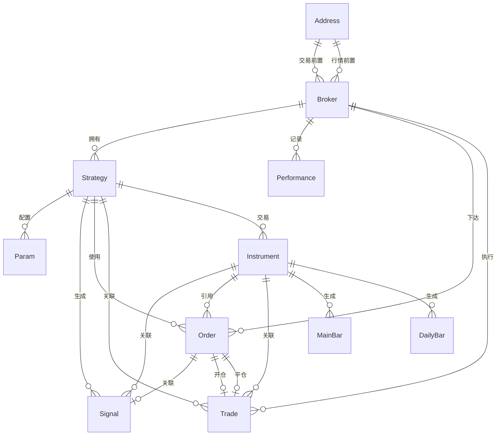

# 数据模型文档

## Django 模型概览

所有模型定义在 `panel/models.py`，使用 Django ORM 进行数据库操作。

## 模型关系图



## 模型详解

### Autonumber

自增序列号模型。

```python
class Autonumber(models.Model):
    id = models.AutoField(verbose_name='自增值', primary_key=True)
    create_date = models.DateTimeField(verbose_name='生成时间', auto_now_add=True)
```

**位置**: `panel/models.py:42-44`

---

### Address

CTP 前置地址配置，包含交易和行情服务器地址。

```python
class Address(models.Model):
    name = models.CharField(verbose_name='名称', max_length=64)
    url = models.CharField(verbose_name='地址', max_length=128)
    type = models.CharField(verbose_name='类型', max_length=16, choices=AddressType.choices)
    operator = models.CharField(verbose_name='运营商', max_length=16, choices=OperatorType.choices)
```

**位置**: `panel/models.py:47-58`

**字段说明**:
- `type`: TRADE (交易) / MARKET (行情)
- `operator`: TELECOM (电信) / UNICOM (联通)

---

### Broker

交易账户，包含资金和保证金信息。

```python
class Broker(models.Model):
    name = models.CharField(verbose_name='名称', max_length=64)
    contract_type = models.CharField(verbose_name='市场', max_length=32, choices=ContractType.choices)
    trade_address = models.ForeignKey(Address, verbose_name='交易前置', ...)
    market_address = models.ForeignKey(Address, verbose_name='行情前置', ...)
    identify = models.CharField(verbose_name='唯一标志', max_length=32)
    username = models.CharField(verbose_name='用户名', max_length=32)
    password = models.CharField(verbose_name='密码', max_length=32)
    fake = models.DecimalField(verbose_name='虚拟资金', ...)
    cash = models.DecimalField(verbose_name='可用资金', ...)
    current = models.DecimalField(verbose_name='动态权益', ...)
    pre_balance = models.DecimalField(verbose_name='静态权益', ...)
    margin = models.DecimalField(verbose_name='保证金', ...)
```

**位置**: `panel/models.py:61-82`

---

### Performance

每日绩效记录。

```python
class Performance(models.Model):
    broker = models.ForeignKey(Broker, verbose_name='账户', ...)
    day = models.DateField(verbose_name='日期')
    capital = models.DecimalField(verbose_name='资金', ...)
    unit_count = models.IntegerField(verbose_name='单位乘数', ...)
    NAV = models.DecimalField(verbose_name='单位净值', ...)
    accumulated = models.DecimalField(verbose_name='累计净值', ...)
    dividend = models.DecimalField(verbose_name='分红', ...)
    used_margin = models.DecimalField(verbose_name='占用保证金', ...)
    fake = models.DecimalField(verbose_name='虚拟', ...)
```

**位置**: `panel/models.py:85-101`

---

### Strategy

交易策略配置，关联经纪商和交易品种。

```python
class Strategy(models.Model):
    broker = models.ForeignKey(Broker, verbose_name='账户', ...)
    name = models.CharField(verbose_name='名称', max_length=64)
    instruments = models.ManyToManyField('Instrument', verbose_name='交易品种')
    force_opens = models.ManyToManyField('Instrument', verbose_name='手动开仓',
                                          related_name='force_opens', blank=True)
```

**位置**: `panel/models.py:104-125`

**方法**:
- `get_instruments()`: 获取交易合约列表
- `get_force_opens()`: 获取手动开仓合约列表

---

### Param

策略参数配置，支持字符串、整数、浮点数类型。

```python
class Param(models.Model):
    strategy = models.ForeignKey(Strategy, verbose_name='策略', ...)
    code = models.CharField('参数名', max_length=64)
    str_value = models.CharField('字符串值', max_length=128, null=True, blank=True)
    int_value = models.IntegerField('整数值', null=True, blank=True)
    float_value = models.DecimalField('浮点值', ..., null=True, blank=True)
    update_time = models.DateTimeField('更新时间', auto_now=True)
```

**位置**: `panel/models.py:128-143`

---

### Instrument

期货合约，包含合约基本信息和交易属性。

```python
class Instrument(models.Model):
    exchange = models.CharField('交易所', max_length=8, choices=ExchangeType.choices)
    section = models.CharField('分类', max_length=48, choices=SectionType.choices)
    sort = models.CharField('品种', max_length=48, choices=SortType.choices)
    name = models.CharField('名称', max_length=32)
    product_code = models.CharField('代码', max_length=16, unique=True)
    all_inst = models.CharField('品种列表', max_length=256)
    main_code = models.CharField('主力合约', max_length=16)
    last_main = models.CharField('上个主力', max_length=16)
    change_time = models.DateTimeField('切换时间')
    night_trade = models.BooleanField('夜盘', default=False)
    volume_multiple = models.IntegerField('合约乘数')
    price_tick = models.DecimalField('最小变动', ...)
    margin_rate = models.DecimalField('保证金率', ...)
    fee_money = models.DecimalField('金额手续费', ...)
    fee_volume = models.DecimalField('手数手续费', ...)
    up_limit_ratio = models.DecimalField('涨停幅度', ...)
    down_limit_ratio = models.DecimalField('跌停幅度', ...)
```

**位置**: `panel/models.py:146-170`

**交易所选项** (ExchangeType):
- SHFE: 上期所
- DCE: 大商所
- CZCE: 郑商所
- CFFEX: 中金所
- INE: 上期能源
- GFEX: 广交所

---

### Signal

交易信号，包含信号类型和优先级。

```python
class Signal(models.Model):
    strategy = models.ForeignKey(Strategy, verbose_name='策略', ...)
    instrument = models.ForeignKey(Instrument, verbose_name='品种', ...)
    code = models.CharField('当前合约', max_length=16)
    type = models.CharField('信号类型', max_length=16, choices=SignalType.choices)
    trigger_value = models.DecimalField(max_digits=12, decimal_places=3, verbose_name='触发值')
    price = models.DecimalField('价格', max_digits=12, decimal_places=3)
    volume = models.IntegerField('数量')
    trigger_time = models.DateTimeField('发生时间')
    priority = models.IntegerField('优先级', choices=PriorityType.choices, default=PriorityType.Normal)
    processed = models.BooleanField('已处理', default=False)
```

**位置**: `panel/models.py:173-191`

**信号类型** (SignalType):
- ROLL_CLOSE: 换月平旧
- ROLL_OPEN: 换月开新
- BUY: 买开
- SELL_SHORT: 卖开
- SELL: 卖平
- BUY_COVER: 买平

---

### MainBar

主力连续合约日K线数据。

```python
class MainBar(models.Model):
    exchange = models.CharField('交易所', max_length=8, choices=ExchangeType.choices)
    product_code = models.CharField('品种代码', max_length=8)
    code = models.CharField('合约代码', max_length=16)
    time = models.DateField('时间', db_index=True)
    open = models.DecimalField(max_digits=12, decimal_places=3, verbose_name='开盘价')
    high = models.DecimalField(max_digits=12, decimal_places=3, verbose_name='最高价')
    low = models.DecimalField(max_digits=12, decimal_places=3, verbose_name='最低价')
    close = models.DecimalField(max_digits=12, decimal_places=3, verbose_name='收盘价')
    settlement = models.DecimalField(max_digits=12, decimal_places=3, verbose_name='结算价')
    volume = models.IntegerField('成交量')
    open_interest = models.DecimalField(max_digits=12, decimal_places=3, verbose_name='持仓量')
    basis = models.DecimalField(max_digits=12, decimal_places=3, verbose_name='基差')
```

**位置**: `panel/models.py:194-213`

---

### DailyBar

单个合约日K线数据。

```python
class DailyBar(models.Model):
    exchange = models.CharField('交易所', max_length=8, choices=ExchangeType.choices)
    code = models.CharField('品种代码', max_length=16)
    expire_date = models.IntegerField('交割时间')
    time = models.DateField('时间', db_index=True)
    open = models.DecimalField(max_digits=12, decimal_places=3, verbose_name='开盘价')
    high = models.DecimalField(max_digits=12, decimal_places=3, verbose_name='最高价')
    low = models.DecimalField(max_digits=12, decimal_places=3, verbose_name='最低价')
    close = models.DecimalField(max_digits=12, decimal_places=3, verbose_name='收盘价')
    settlement = models.DecimalField(max_digits=12, decimal_places=3, verbose_name='结算价')
    volume = models.IntegerField('成交量')
    open_interest = models.DecimalField(max_digits=12, decimal_places=3, verbose_name='持仓量')
```

**位置**: `panel/models.py:216-234`

---

### Order

交易报单。

```python
class Order(models.Model):
    broker = models.ForeignKey(Broker, verbose_name='账户', ...)
    strategy = models.ForeignKey(Strategy, verbose_name='策略', ...)
    order_ref = models.CharField('报单号', max_length=13)
    instrument = models.ForeignKey(Instrument, verbose_name='品种', ...)
    code = models.CharField('合约代码', max_length=16)
    front = models.IntegerField('前置编号')
    session = models.IntegerField('会话编号')
    price = models.DecimalField(max_digits=12, decimal_places=3, verbose_name='报单价格')
    volume = models.IntegerField('手数')
    direction = models.CharField('方向', max_length=8, choices=DirectionType.choices)
    offset_flag = models.CharField('开平', max_length=8, choices=OffsetFlag.choices)
    status = models.CharField('状态', max_length=16, choices=OrderStatus.choices)
    send_time = models.DateTimeField('发送时间')
    update_time = models.DateTimeField('更新时间')
    signal = models.OneToOneField(Signal, verbose_name='信号', ...)
```

**位置**: `panel/models.py:237-259`

**报单状态** (OrderStatus):
- AllTraded: 全部成交
- PartTradedQueueing: 部分成交还在队列中
- NoTradeQueueing: 未成交还在队列中
- Canceled: 撤单

---

### Trade

成交记录。

```python
class Trade(models.Model):
    broker = models.ForeignKey(Broker, verbose_name='账户', ...)
    strategy = models.ForeignKey(Strategy, verbose_name='策略', ...)
    instrument = models.ForeignKey(Instrument, verbose_name='品种', ...)
    open_order = models.OneToOneField(Order, verbose_name='开仓报单', ...)
    close_order = models.OneToOneField(Order, verbose_name='平仓报单', ...)
    code = models.CharField('合约代码', max_length=16)
    direction = models.CharField('方向', max_length=8, choices=DirectionType.choices)
    open_time = models.DateTimeField('开仓日期')
    close_time = models.DateTimeField('平仓日期')
    shares = models.IntegerField('手数')
    filled_shares = models.IntegerField('已成交手数')
    closed_shares = models.IntegerField('已平仓手数')
    avg_entry_price = models.DecimalField(max_digits=12, decimal_places=3, verbose_name='持仓均价')
    avg_exit_price = models.DecimalField(max_digits=12, decimal_places=3, verbose_name='平仓均价')
    profit = models.DecimalField(max_digits=12, decimal_places=3, verbose_name='持仓盈亏')
    frozen_margin = models.DecimalField(max_digits=12, decimal_places=3, verbose_name='冻结保证金')
    cost = models.DecimalField(max_digits=12, decimal_places=2, verbose_name='手续费')
```

**位置**: `panel/models.py:262-288`

## 工具函数

### to_df()

将 Django QuerySet 转换为 pandas DataFrame。

```python
def to_df(queryset, index_col=None, parse_dates=None):
    query, params = queryset.query.sql_with_params()
    return read_sql_query(query, connection, params=params, ...)
```

**位置**: `panel/models.py:25-39`
