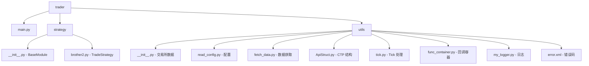

# 模块详解文档

## 模块概览



## trade_trader/main.py

### 功能
系统入口点，负责初始化和启动交易策略。

### 导入依赖
```python
import sys, os, django, redis, logging
from logging import handlers
from trader.strategy.brother2 import TradeStrategy
from trader.utils.read_config import config_file, app_dir, config
```

### 类定义

#### RedislHandler
Redis 发布订阅日志处理器。

```python
class RedislHandler(logging.StreamHandler):
    def __init__(self, channel: str):
        # 连接 Redis，发布日志到指定频道
    def emit(self, message: logging.LogRecord):
        # 发布日志消息
```

### 初始化流程

1. **Django 配置**: 设置 Django settings 模块
2. **三层日志**:
   - `RotatingFileHandler`: 文件日志（最大 1MB，保留 1 个备份）
   - `StreamHandler`: 控制台日志
   - `RedislHandler`: Redis 发布日志
3. **PID 文件**: 写入 `{user_cache_dir}/trader.pid`
4. **启动策略**: `TradeStrategy(name='大哥2.2').run()`

### 日志配置读取
- `LOG.format`: 日志格式
- `LOG.weixin_format`: Redis 日志格式
- `LOG.file_level`: 文件日志级别
- `LOG.flower_level`: Redis 日志级别

---

## trade_trader/strategy/__init__.py

### 功能
定义 `BaseModule` 抽象基类，所有交易策略继承此基类。

### 导入依赖
```python
import redis, ujson, pytz, time, datetime, logging
from collections import defaultdict
from django.utils import timezone
from croniter import croniter
import asyncio
from abc import abstractmethod, ABCMeta
import aioredis
```

### BaseModule 类

#### 初始化
```python
def __init__(self):
    self.io_loop = asyncio.new_event_loop()
    asyncio.set_event_loop(self.io_loop)
    self.redis_client = aioredis.from_url(...)  # 异步 Redis
    self.raw_redis = redis.StrictRedis(...)     # 同步 Redis
    self.sub_client = self.redis_client.pubsub()
    self.channel_router = dict()      # 频道 → 回调函数
    self.crontab_router = defaultdict(dict)  # crontab → 定时任务
```

#### 生命周期方法

| 方法 | 描述 |
|------|------|
| `install()` | 注册回调，订阅频道，启动定时任务 |
| `uninstall()` | 取消订阅，清理资源 |
| `run()` | 启动事件循环 |
| `start()` | 异步启动入口 |
| `stop()` | 异步停止入口 |

#### 内部方法

| 方法 | 描述 |
|------|------|
| `_register_callback()` | 注册装饰器标记的回调函数 |
| `_get_next(key)` | 计算下次 cron 执行时间 |
| `_call_next(key)` | 调度下次 cron 执行 |
| `_msg_reader()` | Redis 消息监听循环 |

#### 消息处理流程

```python
async def _msg_reader(self):
    async for msg in self.sub_client.listen():
        if msg['type'] == 'pmessage':
            pattern = msg['pattern']
            data = json.loads(msg['data'])
            self.io_loop.create_task(self.channel_router[pattern](channel, data))
```

### 使用示例

```python
from trader.strategy import BaseModule

class MyStrategy(BaseModule):
    @RegisterCallback(channel='MSG:CTP:REQ:*')
    async def on_request(self, channel, data):
        pass

    @RegisterCallback(crontab='*/5 * * * *')
    async def periodic_task(self):
        pass
```

---

## trade_trader/strategy/brother2.py

### 功能
主交易策略实现，包含完整的交易逻辑。

### 规模
约 871 行代码，包含：

- 行情订阅处理
- 信号生成与执行
- 订单管理
- 持仓跟踪
- 风险控制

### 主要方法 (部分)

| 方法 | 描述 |
|------|------|
| `on_market_data()` | 行情数据处理 |
| `on_trade_rsp()` | 交易响应处理 |
| `generate_signals()` | 生成交易信号 |
| `execute_order()` | 执行交易订单 |
| `check_position()` | 检查持仓状态 |

### Redis 通信

**请求格式**:
```
MSG:CTP:REQ:{operation} → {"broker_id": ..., "request_id": ..., ...}
```

**响应格式**:
```
MSG:CTP:RSP:TRADE:{broker_id}:{request_id}
MSG:CTP:RSP:MARKET:{broker_id}:{request_id}
```

---

## trade_trader/utils/__init__.py

### 功能
交易所数据获取核心模块，基于信号量的连接池。

### 连接池限制

| 交易所 | 连接数限制 |
|--------|-----------|
| SHFE | 15 |
| DCE | 5 |
| GFEX | 5 |
| CZCE | 15 |
| CFFEX | 15 |
| SINA | 15 |

### 主要函数

| 函数 | 描述 |
|------|------|
| `is_trading_day(date)` | 判断是否为交易日 |
| `update_from_shfe(date)` | 更新上期所数据 |
| `update_from_dce(date)` | 更新大商所数据 |
| `update_from_czce(date)` | 更新郑商所数据 |
| `update_from_cffex(date)` | 更新中金所数据 |
| `create_main_all()` | 创建主力合约数据 |
| `check_trading_day(date)` | 检查交易日状态 |

### 使用示例

```python
from trader.utils import is_trading_day, update_from_shfe

if await is_trading_day(today):
    await update_from_shfe(today)
```

---

## trade_trader/utils/read_config.py

### 功能
配置文件管理，自动创建配置文件。

### 配置文件位置
```
~/.config/trade_trader/config.ini
```

### 导出函数

| 函数 | 描述 |
|------|------|
| `get_dashboard_path()` | 获取 Dashboard 项目路径 |
| `get_error_xml_path()` | 获取 error.xml 路径 |
| `config` | ConfigParser 实例 |
| `ctp_errors` | CTP 错误码字典 |

### 配置节

| 节 | 描述 |
|----|------|
| `[MSG_CHANNEL]` | Redis 频道模式配置 |
| `[TRADE]` | 交易参数配置 |
| `[REDIS]` | Redis 连接配置 |
| `[MYSQL]` | MySQL 连接配置 |
| `[DASHBOARD]` | Dashboard 路径配置 |
| `[LOG]` | 日志配置 |

---

## trade_trader/utils/fetch_data.py

### 功能
数据获取工具脚本，用于批量获取历史数据。

### 主要函数

```python
async def fetch_bar(days=365):
    """获取指定天数的历史数据

    Args:
        days: 回溯天数，默认 365 天
    """
    # 遍历每个交易日
    # 并发获取各交易所数据
```

### 使用方式

```python
# 直接运行会初始化主力合约数据
python -m trader.utils.fetch_data

# 在代码中使用
asyncio.get_event_loop().run_until_complete(fetch_bar(days=90))
```

---

## trade_trader/utils/ApiStruct.py

### 功能
CTP API 数据结构和常量定义。

### 内容

- CTP 结构体定义
- 枚举类型常量
- API 函数签名

---

## trade_trader/utils/tick.py

### 功能
Tick 数据处理工具。

---

## trade_trader/utils/func_container.py

### 功能
回调函数容器和装饰器实现。

### @RegisterCallback 装饰器

```python
def RegisterCallback(**kwargs):
    """注册回调函数

    支持参数:
        channel: Redis 频道模式
        crontab: Cron 表达式
    """
```

---

## trade_trader/utils/my_logger.py

### 功能
日志配置工具。

---

## trade_trader/utils/error.xml

### 功能
CTP 错误码映射表。

### 结构

```xml
<?xml version="1.0"?>
<root>
    <error value="0" prompt="成功" />
    <error value="1" prompt="每秒发请求数超过阈值" />
    ...
</root>
```

---

## panel/models.py

详见 [DATA_MODELS.md](DATA_MODELS.md)

---

## panel/const.py

### 功能
Django Choices 常量定义。

### 主要类型

| 类别 | 类型 |
|------|------|
| `ContractType` | 合约类型（股票/期货/期权） |
| `ExchangeType` | 交易所类型 |
| `SectionType` | 合约分类 |
| `SortType` | 品种分类 |
| `DirectionType` | 方向（多/空） |
| `OffsetFlag` | 开平标志 |
| `OrderStatus` | 报单状态 |
| `SignalType` | 信号类型 |

### 常量字典

| 常量 | 描述 |
|------|------|
| `DCE_NAME_CODE` | 大商所中文名称-代码映射 |
| `MONTH_CODE` | 月份代码映射 (1=F, 2=G, ...) |
| `KT_MARKET` | Kt 行情市场映射 |

**位置**: `panel/const.py`
