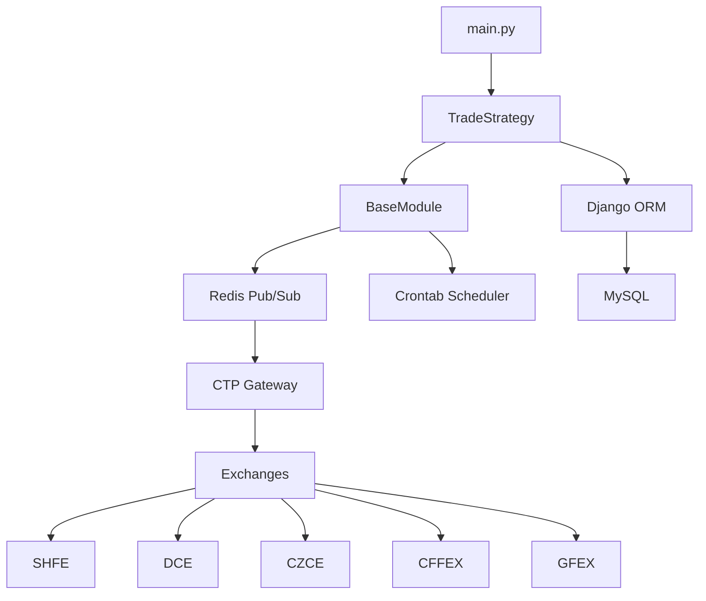

# Trade-Trader 项目文档

> 中国期货交易系统文档 - 面向 LLM 和开发者的技术文档

## 文档目录

| 文档 | 描述 |
|------|------|
| [ARCHITECTURE.md](ARCHITECTURE.md) | 系统架构设计，包含 Mermaid 流程图 |
| [MODULES.md](MODULES.md) | 模块详解，LLM 友好的技术说明 |
| [DATA_MODELS.md](DATA_MODELS.md) | Django 数据模型说明 |
| [CODEBASE_MAP.md](CODEBASE_MAP.md) | 代码库映射，供 LLM 导航 |
| [CLEANUP_TODO.md](CLEANUP_TODO.md) | 代码清理待办清单 |
| [progress.md](progress.md) | 当前进度跟踪 |

## 快速开始

### 安装依赖

```bash
pip install -r requirements.txt
```

### 配置

首次运行时，配置文件会在 `~/.config/trade-trader/config.ini` 自动生成。编辑该文件配置：

- `[DASHBOARD]` - Django Dashboard 项目路径
- `[REDIS]` - Redis 连接设置
- `[MYSQL]` - MySQL 数据库连接
- `[MSG_CHANNEL]` - Redis 发布订阅频道模式
- `[TRADE]` - 交易参数

### 运行

```bash
python -m trade_trader.main
```

## 架构概览



## 核心组件

| 组件 | 文件 | 描述 |
|------|------|------|
| 入口点 | `trade_trader/main.py` | 初始化 Django、日志，启动策略 |
| 基类 | `trade_trader/strategy/__init__.py` | BaseModule 抽象类 |
| 策略 | `trade_trader/strategy/brother2.py` | 主交易策略 |
| 工具 | `trade_trader/utils/` | 数据获取、配置、CTP API |
| 模型 | `panel/models.py` | Django ORM 模型 |

## 集成交易所

- SHFE (上期所) - 上海期货交易所
- DCE (大商所) - 大连商品交易所
- CZCE (郑商所) - 郑州商品交易所
- CFFEX (中金所) - 中国金融期货交易所
- GFEX (广期所) - 广州期货交易所
